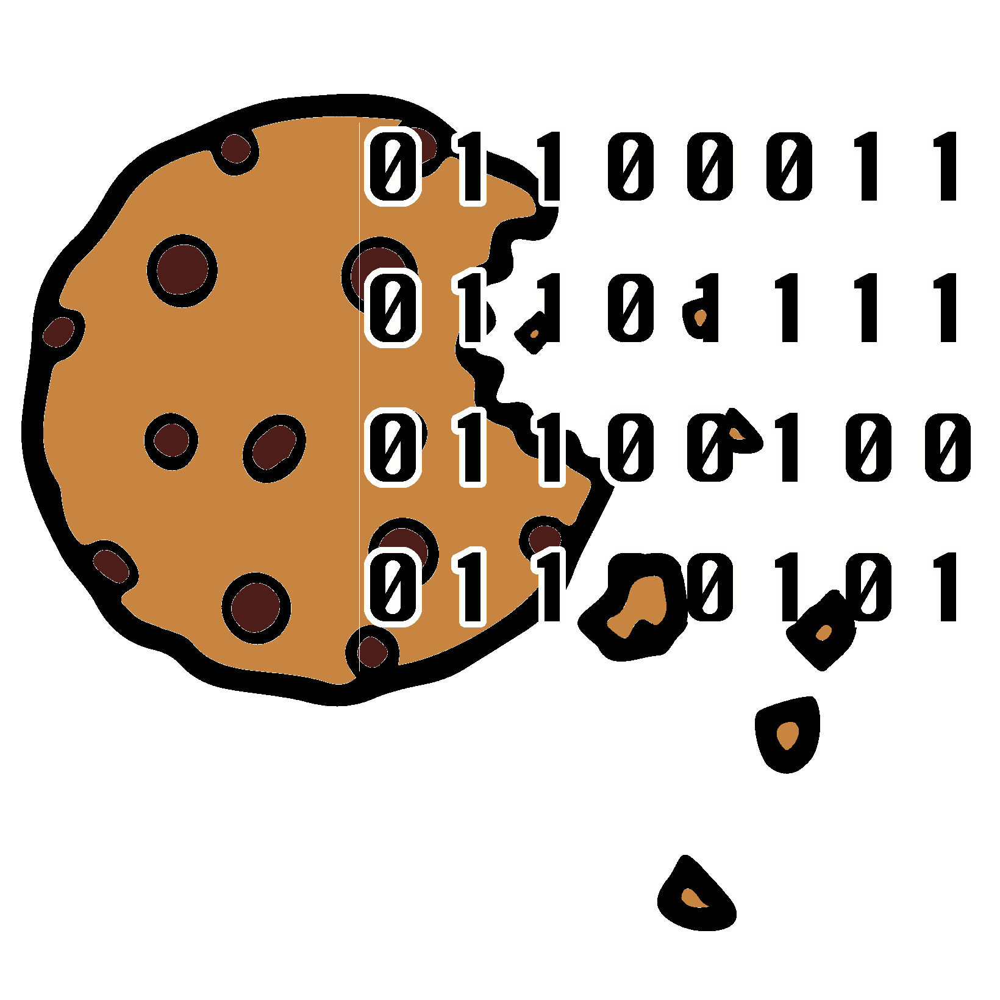

# Code & Cookies

Code & Cookies is an informal and self-organizing assembly of (mostly web)
developers in the greater Enschede area.

Membership is open to anyone who cares to show up at the sporadically organized
gatherings.

Any member can call a meeting, hackathon or meetup whenever they feel like it.
Due to the autonomous nature of the group, attendance is not guaranteed.

To be informed of when we meet, join the [Code & Cookies mailing list](http://tkkrlab.nl/mailman/listinfo/codeandcookies_tkkrlab.nl)

